# Multi-Vendor E-Commerce Platform

**Members**:

- Saani Mustapha Deishini
- Doe Daniel Agudey

**Title**: Design and Implementation of a Scalable Multi-Vendor Platform Using Microservices Architecture

## Table of Contents

- [Abstract](#abstract)
- [Introduction](#introduction)
- [Technologies Used](#technologies-used)
- [Methodology](#methodology)
- [Entity-Relationship Diagram](#entity-relationship-diagram)
- [Message Queues](#message-queues)
- [Service Payloads](#service-payloads)
  - [Authentication Service Payloads](#authentication-service-payloads)
  - [Product Service Payloads](#product-service-payloads)
  - [Order Service Payloads](#order-service-payloads)
  - [Notification Service Payloads](#notification-service-payloads)
- [External APIs Used](#external-apis-used)
- [System Architecture](#system-architecture)
- [Private Git Repositories](#private-git-repositories)
- [Authentication Microservice](#authentication-microservice)
- [Products Microservice](#products-microservice)
- [Order Microservice](#order-microservice)
- [Notification Microservice](#notification-microservice)
- [API Gateway Implementation](#api-gateway-implementation)
- [Frontend Layout and Structure](#frontend-layout-and-structure)
- [Deployment Links](#deployment-links)
- [Conclusion](#conclusion)

## Abstract

This project presents a web-based multi-vendor e-commerce platform built using a microservices architecture. The platform enables sellers to register, log in, and manage product listings, while users can search for items, place orders, and receive notifications. It comprises five core microservices: Authentication, Product, Search, Order, and Notification, communicating asynchronously via **RabbitMQ**. **MongoDB** stores data, **Backblaze B2** handles image storage, and **SendGrid** powers email notifications. An **API Gateway** routes client requests, enhancing security and scalability. **Elasticsearch** ensures efficient product search, and **JWT** with role-based access control (RBAC) secures user management. The frontend offers a user-friendly interface, deployed on **Vercel** and **Render**, with CI/CD pipelines via **GitHub Actions**.

## Introduction

The rise of e-commerce demands scalable, modular platforms to handle multiple vendors and users. This project builds a **web-based multi-vendor platform** using a microservices architecture, enabling sellers to manage listings and users to browse, order, and receive notifications. The system ensures modularity, scalability, and extensibility, applying modern software engineering principles like CI/CD and distributed systems.

## Technologies Used

### Backend Development

- **Node.js**: Server-side JavaScript runtime for scalable services.
- **Express.js**: Framework for RESTful APIs.
- **JWT**: For authentication and authorization.
- **bcrypt**: For secure password hashing.

### Microservices Architecture

- **RabbitMQ**: Message broker for asynchronous communication.
- **Docker**: For containerizing microservices.

### Database

- **MongoDB**: NoSQL database for user, product, and order data.
- **Redis**: For session management and caching.

### Search

- **Elasticsearch**: For fast product search functionality.

### File Storage

- **Backblaze B2**: For product image storage.

### External APIs

- **SendGrid**: For email notifications.

### Frontend Development

- **HTML, Bootstrap CSS, JavaScript**: For responsive UI.
- **EJS**: For dynamic server-side rendering.

### DevOps & CI/CD

- **GitHub Actions**: For continuous integration and deployment.
- **Git**: For version control with feature branching.

### System Design

- **Excalidraw**: For architecture diagrams.

## Methodology

### Task 1: Design Database Schemas

Each microservice has tailored database schemas:

- **Authentication Service**: `Users` table with fields: `username`, `email`, `password`, `role`, `profileImage`, `shopName`, `shopDescription`, `shopAddress`, `createdAt`.  
  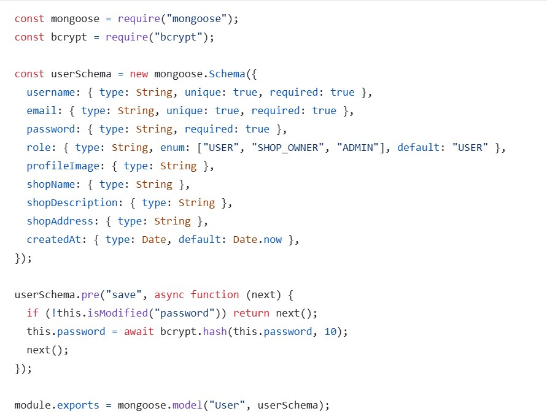
- **Product Service**: `Products` table with fields: `title`, `description`, `category_id`, `price`, `quantity`, `image`, `imageID`, `seller_id`, `seller_profileUrl`, `seller_profileImageId`, `timestamps`.  
  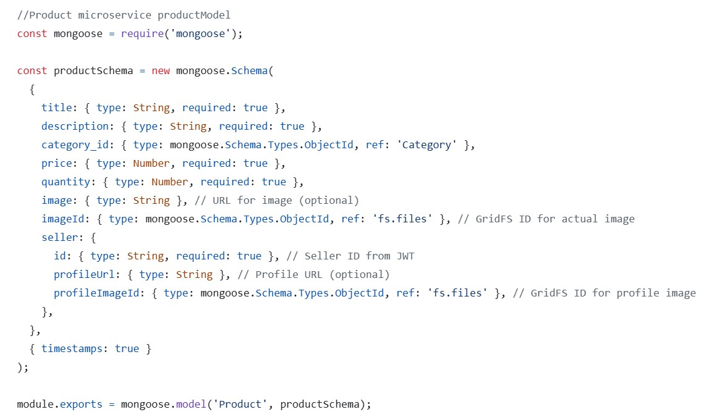
- **Order Service**: `Orders` table with fields: `user_id`, `user_profileUrl`, `productId`, `quantity`, `totalAmount`, `status`, `timestamps`.  
  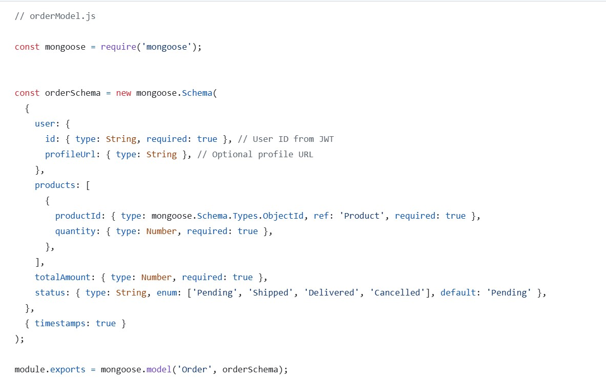
- **Notification Service**: `Notifications` table with fields: `userID`, `message`, `service`, `createdAt`.  
  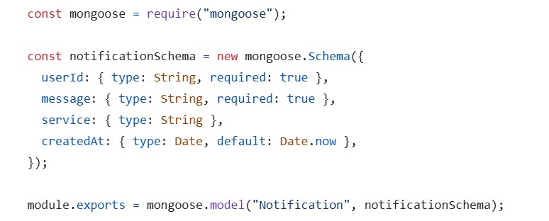
- **Search Service**: Uses **Elasticsearch** for efficient querying and filtering of orders.  
  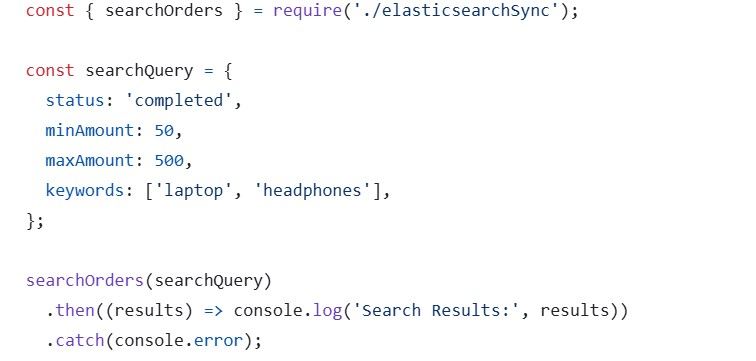

## Entity-Relationship Diagram

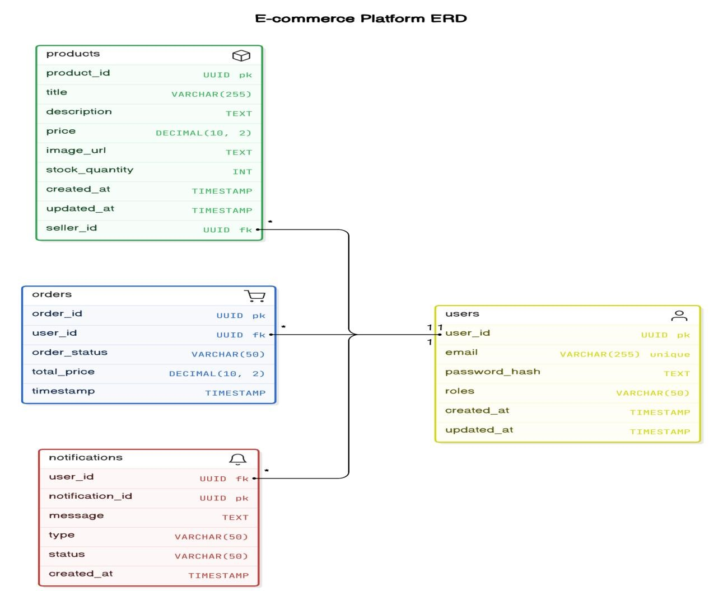

## Message Queues

**RabbitMQ** handles inter-service communication with the following queues:

1. **Order_Placed Queue** (Fanout):

   - **Purpose**: Notify services about new orders.
   - **Subscribers**: Notification Service, Product Service.
   - **Flow**: Publishes `order_placed` events for notifications and inventory updates.

2. **Notification Queue** (Direct):

   - **Purpose**: Handle notification events (e.g., emails).
   - **Subscribers**: Notification Service.
   - **Flow**: Publishes `send_email` events for user notifications.

3. **Inventory_Update Queue** (Direct):

   - **Purpose**: Update product stock levels.
   - **Subscribers**: Product Service.
   - **Flow**: Publishes `inventory_update` events for stock adjustments.

4. **User_Registration Queue** (Direct):

   - **Purpose**: Handle post-registration events (e.g., welcome emails).
   - **Subscribers**: Notification Service.
   - **Flow**: Publishes `user_registered` events.

5. **Order_Status_Update Queue** (Fanout):

   - **Purpose**: Notify about order status changes.
   - **Subscribers**: Notification Service, Product Service.
   - **Flow**: Publishes `order_status_update` events for notifications and restocking.

6. **Search_Index_Update Queue** (Direct):
   - **Purpose**: Synchronize product data with search index.
   - **Subscribers**: Search Service.
   - **Flow**: Publishes `search_index_update` events for product updates.

## Service Payloads

### Authentication Service Payloads

1. **User Registration Payload**:

   ```json
   {
     "username": "john_doe",
     "email": "john.doe@example.com",
     "password": "securepassword123",
     "role": "seller",
     "profileImage": "url_to_image",
     "shopName": "John's Electronics",
     "shopDescription": "A shop for all your electronic needs",
     "shopAddress": "1234 Street, City, Country",
     "createdAt": "2024-12-21T10:30:00Z"
   }
   ```

2. **User Login Payload**:

   ```json
   {
     "email": "john.doe@example.com",
     "password": "securepassword123"
   }
   ```

3. **User Update Payload**:
   ```json
   {
     "username": "john_doe_updated",
     "email": "john.doe@example.com",
     "role": "seller",
     "profileImage": "url_to_updated_image",
     "shopName": "John's Electronics Updated",
     "shopDescription": "The best electronics shop",
     "shopAddress": "5678 Street, City, Country",
     "updatedAt": "2024-12-21T15:00:00Z"
   }
   ```

### Product Service Payloads

1. **Add Product Payload**:

   ```json
   {
     "title": "Laptop",
     "description": "High-performance laptop with 16GB RAM",
     "category_id": "electronics",
     "price": 999.99,
     "quantity": 50,
     "image": "url_to_product_image",
     "imageID": "image_id_123",
     "seller_id": "67890",
     "seller_profileUrl": "url_to_seller_profile",
     "seller_profileImageId": "profile_image_id_456",
     "createdAt": "2024-12-21T11:00:00Z"
   }
   ```

2. **Update Product Payload**:

   ```json
   {
     "product_id": "101",
     "title": "Updated Laptop",
     "description": "Updated description for laptop",
     "category_id": "electronics",
     "price": 899.99,
     "quantity": 40,
     "image": "url_to_updated_product_image",
     "imageID": "image_id_124",
     "seller_id": "67890",
     "updatedAt": "2024-12-21T14:00:00Z"
   }
   ```

3. **Delete Product Payload**:
   ```json
   {
     "product_id": "101",
     "deletedAt": "2024-12-21T14:30:00Z"
   }
   ```

### Order Service Payloads

1. **Place Order Payload**:

   ```json
   {
     "user_id": "67890",
     "user_profileUrl": "url_to_user_profile",
     "product_ids": ["101", "102"],
     "quantities": [1, 2],
     "total_amount": 1499.98,
     "status": "pending",
     "createdAt": "2024-12-21T11:30:00Z"
   }
   ```

2. **Order Status Update Payload**:

   ```json
   {
     "order_id": "12345",
     "status": "shipped",
     "updatedAt": "2024-12-21T12:00:00Z"
   }
   ```

3. **Cancel Order Payload**:
   ```json
   {
     "order_id": "12345",
     "user_id": "67890",
     "deleteAt": "2024-12-21T12:30:00Z"
   }
   ```

### Notification Service Payloads

1. **Send Email Notification Payload**:
   ```json
   {
     "user_id": "67890",
     "message": "Your order #12345 has been shipped!",
     "service": "Email Service",
     "createdAt": "2024-12-21T12:45:00Z"
   }
   ```

## External APIs Used

- **Elasticsearch API**: Powers product search and indexing.
- **Amazon S3**: Stores product images (noted as Backblaze B2 in some sections; assuming S3 for consistency).
- **SendGrid**: Sends email notifications via Nodemailer.

## System Architecture

The platform uses a microservices architecture with an API Gateway routing client requests to Authentication, Product, Order, Notification, and Search services. **RabbitMQ** ensures asynchronous communication, and **MongoDB** stores data.  


## Private Git Repositories

Each microservice is hosted in a private GitHub repository for secure development and collaboration, with CI/CD pipelines via **GitHub Actions**.

## Authentication Microservice

### Overview

Manages user authentication, authorization, and profile management using **JWT**, **bcrypt**, and **RabbitMQ**.

### Key Features

- **User Registration and Login**: Secure registration with password hashing and JWT token issuance.
- **Security**: Uses bcrypt for passwords and short-lived (15-min) access tokens with 7-day refresh tokens.
- **Role-Based Access Control**: Supports `USER`, `SHOP_OWNER`, and `ADMIN` roles.
- **Token Refreshing**: Refreshes access tokens using Redis-stored refresh tokens.
- **Event-Driven Architecture**: Publishes `user_data_sync` and `auth_events` to RabbitMQ.
- **Backblaze B2 Integration**: Stores profile images.
- **Middleware**: Authenticates and validates roles for API requests.

### API Endpoints

| Method | Endpoint       | Description              | Roles                   |
| ------ | -------------- | ------------------------ | ----------------------- |
| POST   | /register      | Register a new user      | None                    |
| POST   | /login         | Authenticate a user      | None                    |
| POST   | /refresh-token | Refresh access token     | USER, SHOP_OWNER, ADMIN |
| POST   | /logout        | Revoke refresh token     | USER, SHOP_OWNER, ADMIN |
| GET    | /profile/:id   | Retrieve user profile    | USER, SHOP_OWNER, ADMIN |
| GET    | /shop-owners   | Retrieve all shop owners | ADMIN                   |
| PUT    | /edit          | Update user profile      | USER, SHOP_OWNER, ADMIN |

### GitHub Link

[Authentication Microservice](https://github.com/Airlectric/E-commerce-authentication-microservice-nodejs)

## Products Microservice

### Overview

Manages product and category operations, integrating with **Elasticsearch**, **GridFS**, and **RabbitMQ**.

### Architecture

- **Frameworks**: Node.js, Express, Mongoose.
- **Storage**: MongoDB with GridFS for images.
- **Search**: Elasticsearch for product indexing.
- **Messaging**: RabbitMQ for event-driven communication.

### API Endpoints

| Method | Endpoint                   | Description              | Roles                   |
| ------ | -------------------------- | ------------------------ | ----------------------- |
| GET    | /category                  | Fetch all categories     | USER, SHOP_OWNER        |
| POST   | /category                  | Add a category           | SHOP_OWNER, ADMIN       |
| POST   | /category/:id              | Update a category        | SHOP_OWNER, ADMIN       |
| POST   | /category/:id/delete       | Delete a category        | SHOP_OWNER, ADMIN       |
| GET    | /products                  | Fetch all products       | USER, SHOP_OWNER        |
| POST   | /products                  | Create a product         | SHOP_OWNER, ADMIN       |
| GET    | /products/:id              | Fetch a product by ID    | USER, SHOP_OWNER, ADMIN |
| PUT    | /products/:id              | Update a product         | SHOP_OWNER, ADMIN       |
| DELETE | /products/:id              | Delete a product         | SHOP_OWNER, ADMIN       |
| GET    | /products/seller/:sellerId | Fetch products by seller | USER, SHOP_OWNER, ADMIN |

### GitHub Link

[Products Microservice](https://github.com/Airlectric/E-commerce-products-microservice)

## Order Microservice

### Overview

Manages order lifecycles, integrating with **RabbitMQ** and **GridFS**.

### Key Features

- **Order Management**: Create, retrieve, update, delete orders.
- **Product Integration**: Validates product availability.
- **Messaging**: Uses `update_inventory` and `order_events_for_notifications` queues.

### API Endpoints

| Method | Endpoint                  | Description                  | Roles                   |
| ------ | ------------------------- | ---------------------------- | ----------------------- |
| POST   | /orders                   | Create a new order           | USER, SHOP_OWNER        |
| GET    | /orders                   | Retrieve user orders         | USER, SHOP_OWNER, ADMIN |
| GET    | /orders/all               | Retrieve all orders          | SHOP_OWNER, ADMIN       |
| GET    | /orders/user/:userId      | Retrieve orders by user ID   | ADMIN                   |
| GET    | /orders/:id               | Retrieve order by ID         | USER, SHOP_OWNER, ADMIN |
| PUT    | /orders/:id               | Update order (if pending)    | USER, SHOP_OWNER, ADMIN |
| DELETE | /orders/:id               | Delete order (if pending)    | USER, SHOP_OWNER, ADMIN |
| PATCH  | /orders/:id               | Update order status          | SHOP_OWNER, ADMIN       |
| GET    | /products                 | Retrieve all products        | USER, SHOP_OWNER        |
| GET    | /products/:id             | Retrieve product by ID       | USER, SHOP_OWNER, ADMIN |
| GET    | /products/search          | Search products with filters | USER, SHOP_OWNER        |
| GET    | /images/uploads/:filename | Stream image file            | All                     |

### GitHub Link

[Order Microservice](https://github.com/Airlectric/E-commerce-order-microservice)

## Notification Microservice

### Overview

Handles notifications using **RabbitMQ** and **Nodemailer** for emails.

### Architecture

- **Database**: MongoDB for user details.
- **Messaging**: RabbitMQ with queues (`product_events_for_notifications`, `order_events_for_notifications`, `auth_events`, `user_data_sync`).
- **Email**: Nodemailer with Gmail SMTP.

### API Endpoints

| Method | Endpoint | Description                | Roles |
| ------ | -------- | -------------------------- | ----- |
| GET    | /alive   | Confirm service is running | All   |

### GitHub Link

[Notification Microservice](https://github.com/Airlectric/E-commerce-notifications-microservice)

## API Gateway Implementation

### Overview

Acts as a unified entry point, routing requests to microservices using **http-proxy-middleware**.

### Key Features

- **Reverse Proxy**: Routes requests to Authentication, Product, and Order services.
- **CORS**: Enables cross-origin requests.
- **Error Handling**: Returns consistent error responses.

### Architecture

- **Routes**: `/auth`, `/products`, `/orders`.
- **Port**: 8000 (configurable).

## Frontend Layout and Structure

### Overview

Built with **Express.js**, **EJS**, and **Bootstrap**, integrating with microservices via **Axios**.

### Key Features

- **User Registration/Login**: Secure authentication with Redis session management.
- **Order Management**: Browse products, manage cart, and place orders.
- **Shop Owner Dashboard**: Manage products and categories.
- **Admin Dashboard**: Oversee users, products, and orders.

### Screenshots

- **Landing Page**: 
- **Registration Form**: 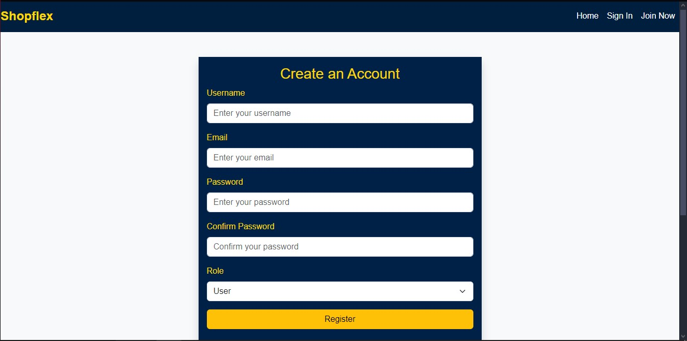
- **Login Form**: 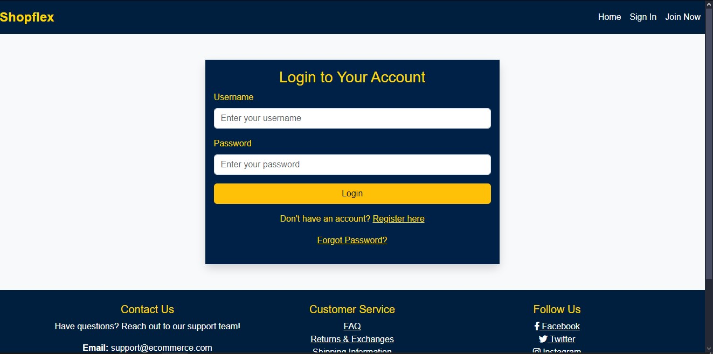
- **Logout Prompt**: 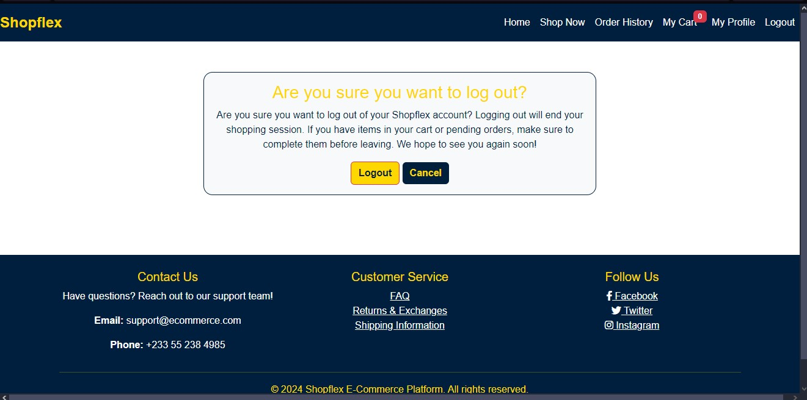
- **Role Selection**: 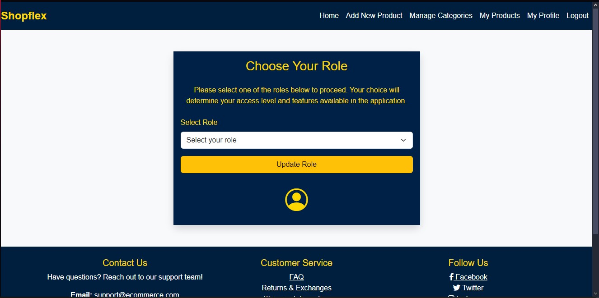
- **Profile Editing**: 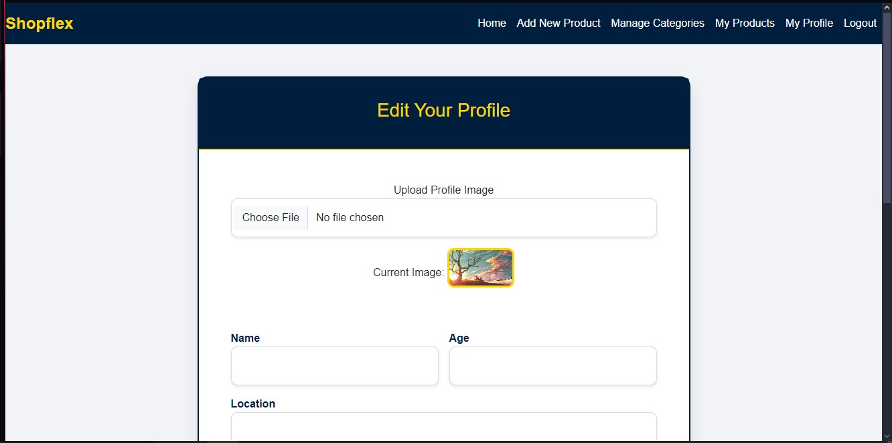
- **User Dashboard**: 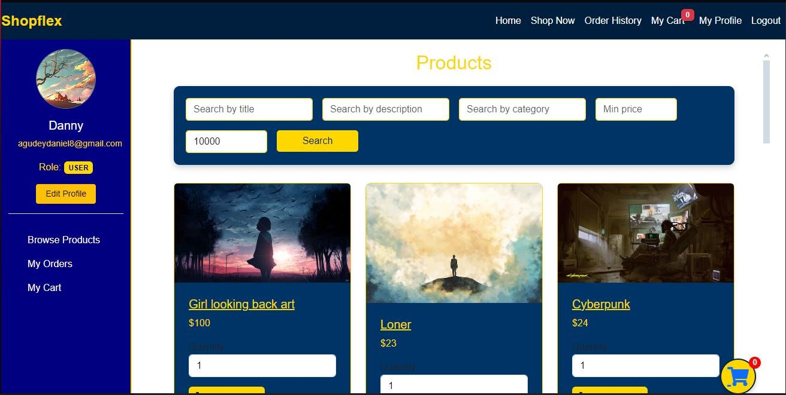
- **Product Listing**: 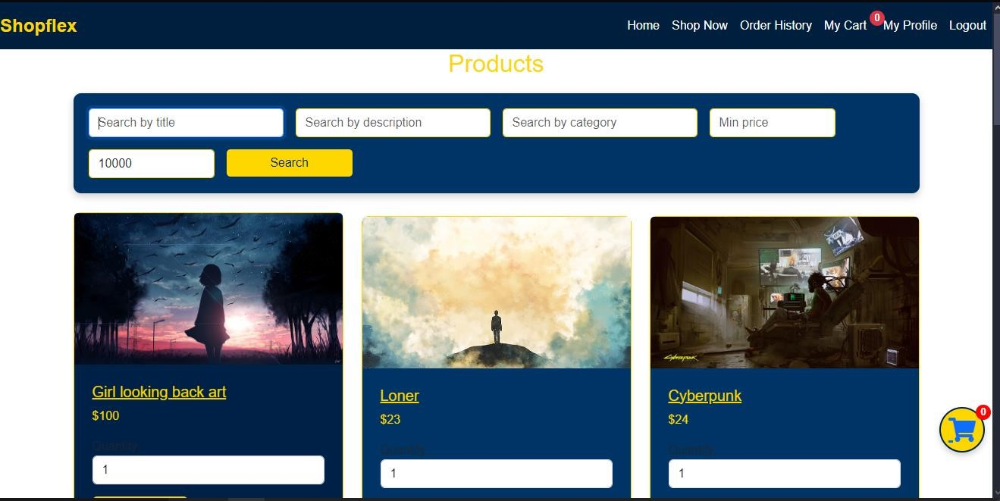
- **Product Details**: 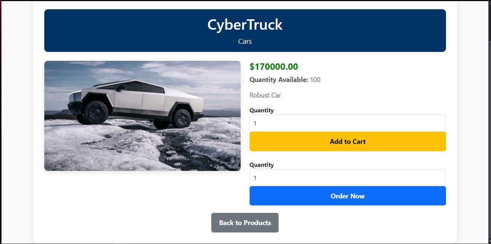
- **Cart Page**: 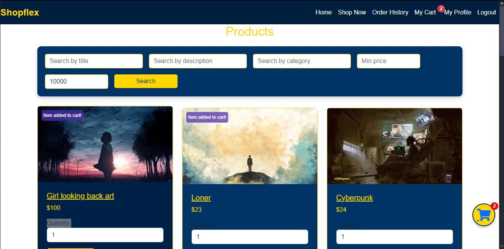
- **Checkout Page**: 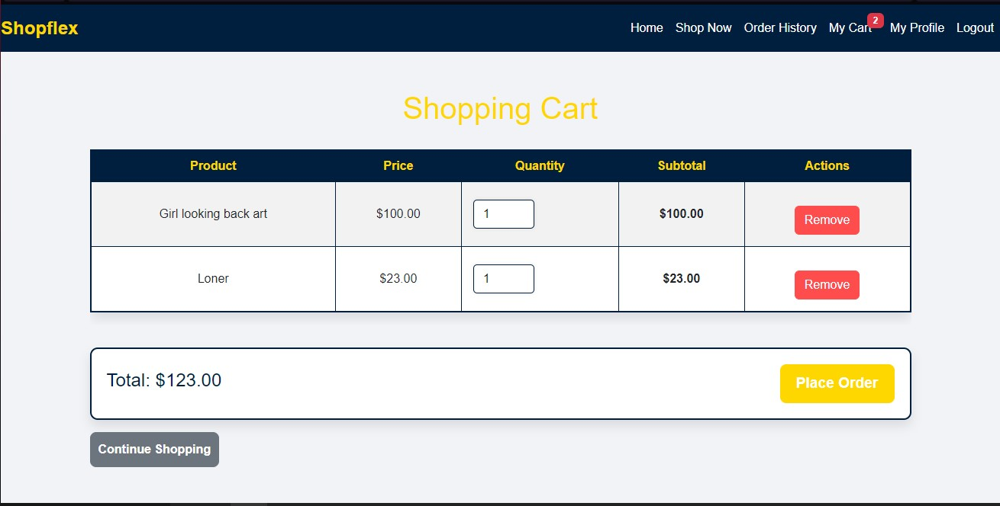
- **Orders Summary**: 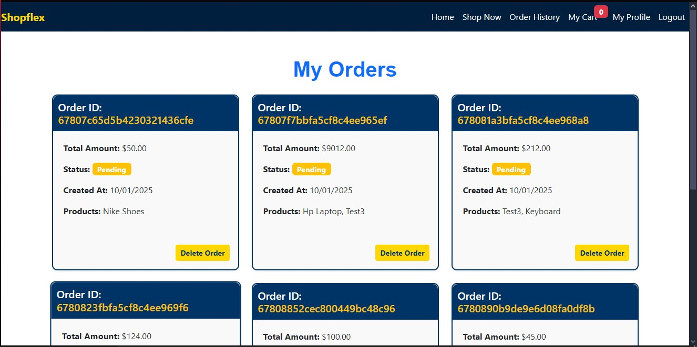
- **Order Details**: 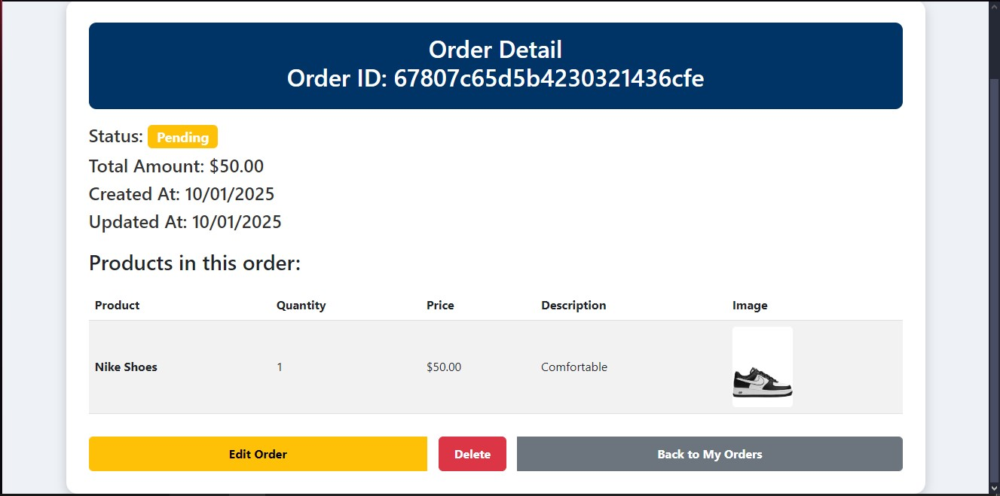
- **Shop Owner Dashboard**: 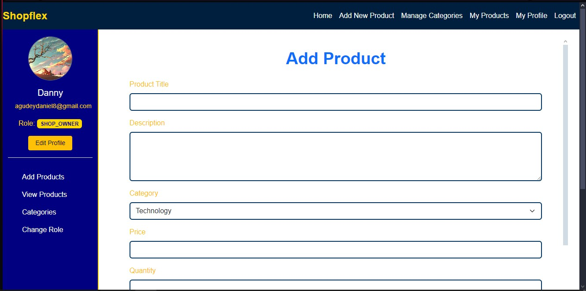
- **Admin Dashboard**: 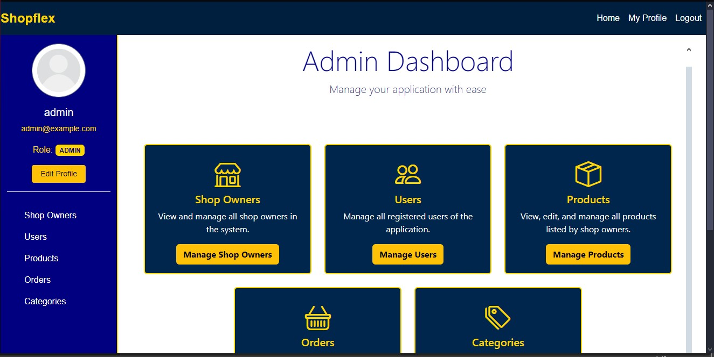

### GitHub Link

[Frontend](https://github.com/Airlectric/E-commerce-frontend-nodejs)

## Deployment Links

- **Authentication Microservice**: [https://e-commerce-authentication-microservice-nodejs.vercel.app/](https://e-commerce-authentication-microservice-nodejs.vercel.app/)
- **Products Microservice**: [https://e-commerce-products-microservice.onrender.com/](https://e-commerce-products-microservice.onrender.com/)
- **Order Microservice**: [https://e-commerce-order-microservice.onrender.com/](https://e-commerce-order-microservice.onrender.com/)
- **Notification Microservice**: [https://e-commerce-notifications-microservice.onrender.com/](https://e-commerce-notifications-microservice.onrender.com/)
- **API Gateway**: [https://shop-flex-api-gateway.vercel.app/](https://shop-flex-api-gateway.vercel.app/)
- **Frontend**: [https://shopflex-ecommerce.vercel.app/](https://shopflex-ecommerce.vercel.app/)

## Conclusion

This multi-vendor platform demonstrates the power of microservices for scalability and modularity. Using **RabbitMQ**, **MongoDB**, **Elasticsearch**, and **SendGrid**, it achieves robust functionality, security, and user experience. The project lays a foundation for future enhancements like push notifications and advanced analytics.
